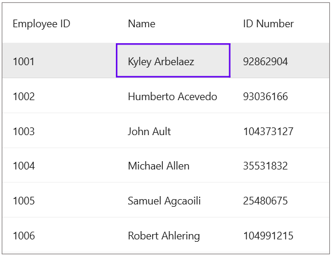

# How to trigger the events in SfDataGrid by using the commands defined in the ViewModel?
Events in SfDataGrid can be fired by using commands with the help of Microsoft.Maui.Controls.Behaviors The Behaviors allows you to convert events into commands. To use it, you need to install the CommunityToolkit.Maui NuGet in your application which can be find in the below link.

NuGet Link: https://www.nuget.org/packages/CommunityToolkit.Maui

Refer the below code example in which Maui.Behaviors has been used to convert the SelectionChanged event in SfDataGrid into command.

## XAML
In the XAML page, use the EventToCommandBehavior within the Datagrid's behavior to trigger the command through an event.

```XML
<?xml version="1.0" encoding="utf-8" ?>
<ContentPage xmlns="http://schemas.microsoft.com/dotnet/2021/maui"
             xmlns:x="http://schemas.microsoft.com/winfx/2009/xaml"
             xmlns:syncfusion="clr-namespace:Syncfusion.Maui.DataGrid;assembly=Syncfusion.Maui.DataGrid"
             xmlns:local="clr-namespace:SfDataGridSample"
             xmlns:toolkit="http://schemas.microsoft.com/dotnet/2022/maui/toolkit"
             x:Class="SfDataGridSample.MainPage">

    <ContentPage.BindingContext>
        <local:EmployeeViewModel />
    </ContentPage.BindingContext>

    <syncfusion:SfDataGrid  x:Name="datagrid" Padding="10"
                            ItemsSource="{Binding Employees}"
                            AutoGenerateColumnsMode="None"
                            SelectionMode="Multiple"
                            DefaultColumnWidth="155">
        <syncfusion:SfDataGrid.Columns>
            <syncfusion:DataGridTextColumn MappingName="EmployeeID"
                                           HeaderText="Employee ID" />
            <syncfusion:DataGridTextColumn MappingName="Name"
                                           HeaderText="Name" />
            <syncfusion:DataGridTextColumn MappingName="IDNumber"
                                           HeaderText="ID Number" />
        </syncfusion:SfDataGrid.Columns>
        
        <syncfusion:SfDataGrid.Behaviors>
            <toolkit:EventToCommandBehavior
                EventName="SelectionChanged"
                Command="{Binding SelectionCommand}" />
        </syncfusion:SfDataGrid.Behaviors>
    </syncfusion:SfDataGrid>
</ContentPage>
```

## ViewModel.cs

```C#
private Command selectionCommand;
public Command SelectionCommand
{
    get { return selectionCommand; }
    set { selectionCommand = value; }
}
 
public ViewModel()
{
    selectionCommand = new Command(onSelectionChanged);
}
 
private void onSelectionChanged()
{
   // Your logic here
}
```
The following screenshot shows the SelectionChanged event invoke a command in SfDataGrid.



[View sample in GitHub](https://github.com/SyncfusionExamples/How-to-triggered-the-events-in-SfDataGrid-by-using-the-commands-defined-in-the-ViewModel-/tree/862822)

Take a moment to pursue this [documentation](https://help.syncfusion.com/maui/datagrid/overview), where you can find more about Syncfusion .NET MAUI DataGrid (SfDataGrid) with code examples.
Please refer to this [link](https://www.syncfusion.com/maui-controls/maui-datagrid) to learn about the essential features of Syncfusion .NET MAUI DataGrid(SfDataGrid).

### Conclusion
I hope you enjoyed learning about trigger the events in SfDataGrid by using the commands defined in the ViewModel.

You can refer to our [.NET MAUI DataGrid�s feature tour](https://www.syncfusion.com/maui-controls/maui-datagrid) page to know about its other groundbreaking feature representations. You can also explore our .NET MAUI DataGrid Documentation to understand how to present and manipulate data.
For current customers, you can check out our .NET MAUI components from the [License and Downloads](https://www.syncfusion.com/account/downloads) page. If you are new to Syncfusion, you can try our 30-day free trial to check out our .NET MAUI DataGrid and other .NET MAUI components.
If you have any queries or require clarifications, please let us know in comments below. You can also contact us through our [support forums](https://www.syncfusion.com/forums), [Direct-Trac](https://support.syncfusion.com/account/login?ReturnUrl=%2Faccount%2Fconnect%2Fauthorize%2Fcallback%3Fclient_id%3Dc54e52f3eb3cde0c3f20474f1bc179ed%26redirect_uri%3Dhttps%253A%252F%252Fsupport.syncfusion.com%252Fagent%252Flogincallback%26response_type%3Dcode%26scope%3Dopenid%2520profile%2520agent.api%2520integration.api%2520offline_access%2520kb.api%26state%3D8db41f98953a4d9ba40407b150ad4cf2%26code_challenge%3DvwHoT64z2h21eP_A9g7JWtr3vp3iPrvSjfh5hN5C7IE%26code_challenge_method%3DS256%26response_mode%3Dquery) or [feedback portal](https://www.syncfusion.com/feedback/maui?control=sfdatagrid). We are always happy to assist you!